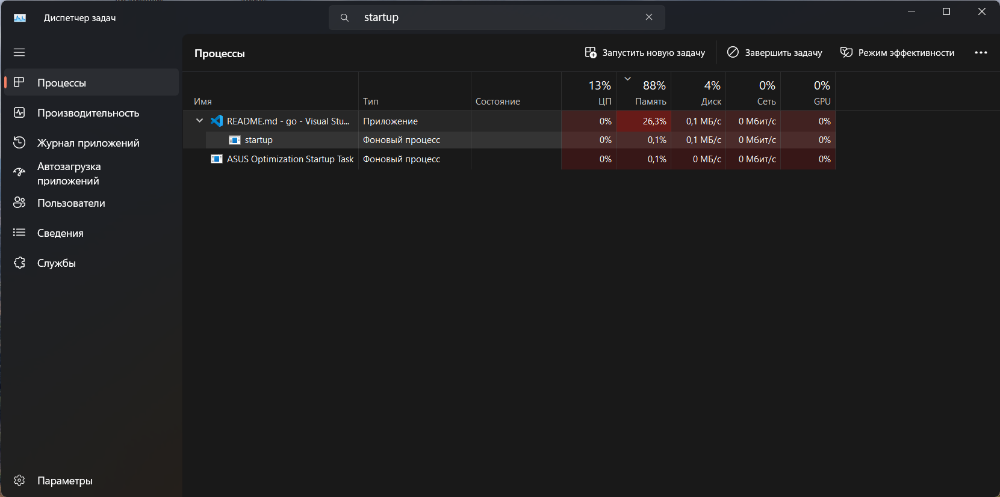
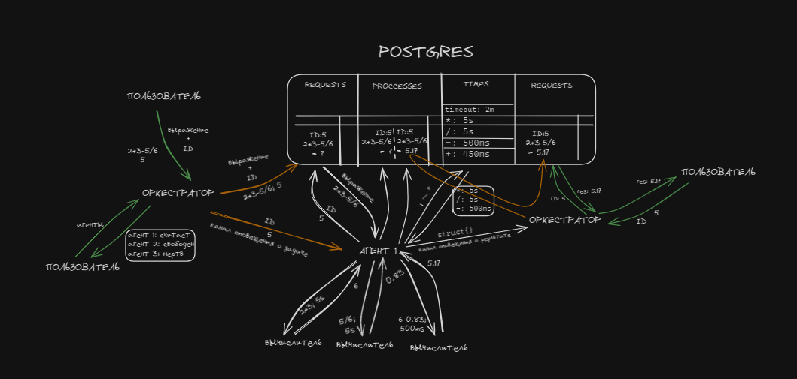
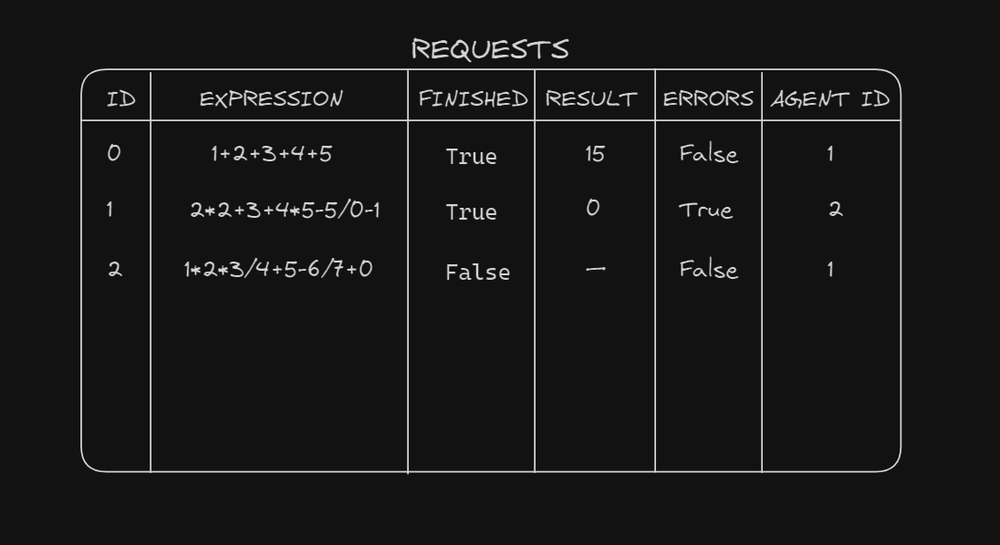
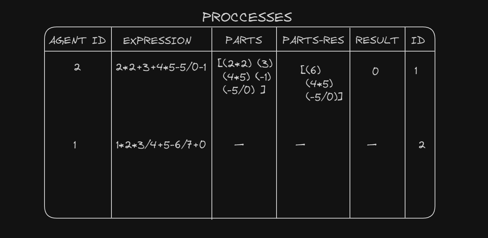

# "Распределенный вычислитель арифметических выражений"

## Оглавление readme
1. [Что реализовано + контакты](https://github.com/Tikhon2783/Epic-calculator?tab=readme-ov-file#%D1%87%D1%82%D0%BE-%D1%80%D0%B5%D0%B0%D0%BB%D0%B8%D0%B7%D0%BE%D0%B2%D0%B0%D0%BD%D0%BE)
1. [Как запускать](https://github.com/Tikhon2783/Epic-calculator?tab=readme-ov-file#%D0%BA%D0%B0%D0%BA-%D0%B7%D0%B0%D0%BF%D1%83%D1%81%D0%BA%D0%B0%D1%82%D1%8C)
    * [Что установить](https://github.com/Tikhon2783/Epic-calculator?tab=readme-ov-file#%D1%87%D1%82%D0%BE-%D1%83%D1%81%D1%82%D0%B0%D0%BD%D0%B0%D0%B2%D0%BB%D0%B8%D0%B2%D0%B0%D1%82%D1%8C)
    * [Как пользоваться](https://github.com/Tikhon2783/Epic-calculator?tab=readme-ov-file#%D0%BA%D0%B0%D0%BA-%D0%BF%D0%BE%D0%BB%D1%8C%D0%B7%D0%BE%D0%B2%D0%B0%D1%82%D1%8C%D1%81%D1%8F)
    * [Что и как можно ломать](https://github.com/Tikhon2783/Epic-calculator?tab=readme-ov-file#%D1%87%D1%82%D0%BE-%D0%B8-%D0%BA%D0%B0%D0%BA-%D0%BC%D0%BE%D0%B6%D0%BD%D0%BE-%D0%BB%D0%BE%D0%BC%D0%B0%D1%82%D1%8C)
1. [Примеры](https://github.com/Tikhon2783/Epic-calculator?tab=readme-ov-file#%D0%BF%D1%80%D0%B8%D0%BC%D0%B5%D1%80%D1%8B)
1. [Документация](https://github.com/Tikhon2783/Epic-calculator?tab=readme-ov-file#%D0%B4%D0%BE%D0%BA%D1%83%D0%BC%D0%B5%D0%BD%D1%82%D0%B0%D1%86%D0%B8%D1%8F)
    1. [Как все работает](https://github.com/Tikhon2783/Epic-calculator?tab=readme-ov-file#%D0%BF%D1%80%D0%B8%D0%BD%D1%86%D0%B8%D0%BF-%D1%80%D0%B0%D0%B1%D0%BE%D1%82%D1%8B)
    2. [Логгеры](https://github.com/Tikhon2783/Epic-calculator?tab=readme-ov-file#%D0%BB%D0%BE%D0%B3%D0%B8%D1%80%D0%BE%D0%B2%D0%B0%D0%BD%D0%B8%D0%B5)
    3. [Ошибки](https://github.com/Tikhon2783/Epic-calculator?tab=readme-ov-file#%D0%BE%D1%88%D0%B8%D0%B1%D0%BA%D0%B8)
---
### !!! К сожалению, не успел доделать до дедлайна, очень прошу дать время до вторника, нужно доделать пару методов и переписать readme - оно уже не актуально 

---
### Что реализовано 
Я постарался реализовать все, кроме фронтенда, возможность делить выражение и отправлять нескольким агентам тоже не получилась. Если есть какие-то вопросы, что-то не работает или у меня где-то ошибки — мой телеграмм @Tikhon1111 (я есть в чате курса)

#### Общий принцип работы
Калькулятор состоит из 3 частей - оркестратора, агентов и вычислителей. Оркестратор контролирует http сервер и управляет агентами, отправляя им выражения. Агенты представленны горутинами, однако, насколько возможно, имитируют что-то наподобии отдельных серверов. У агента есть горутины-вычислители, которые только умеют считать простейшие операции (a+b a-b a*b a/b), "спать" и отправлять результат агенту. Агент, когда получает выражение, превращает его в набор таких простых операций и организовывает работу вычислителей, а потом возвращает результат оркестратору.   
  Подробнее об этом в пункте 4 (документация) - "как все работает".

#### Реализация
Программа должна переживать перезапуск, поэтому значения, связанные с выражениями хранятся в базе данных PostgreSQL.

   При первом запуске подготавливается БД — создаются необходимые хранилища (таблицы).  
   Потом запускается оркестратор: сначала он запускает агентов, потом горутину мониторинга агентов, и, наконец, http сервер.  
   На один endpoint сервера пользователь отправляет запрос с выражением и ключом
   идемпотентности, оркестратор проверяет его и возвращает код (200, 400, 500). Если все хорошо, передает выражение агенту и ожидает дальнейших событий. Ошибку деления на ноль получает вычислитель и передает агенту, который сразу сообщает об этом оркестратору, не досчитывая выражение. Поддерживаются +, -, *, /, скобки не поддерживаются. Унарный минус нельзя ставить перед другим минусов, операция сложения с отрицательным числом считается за операцию вычитания.  
   Существуют также endpoint-ы для получения статуса/результата выражения по ключу идемпотентности, для получения списка таких статусов для всех выражений, получения и изменения времени на выполнение простейших операций и таймаутов для агентов (насколько долго агент может считаться живым, не посылая хартбиты). Есть еще endpoint-ы для получения статусов агентов (интерфейс мониторинга воркеров) и для "убийства" различных компонентов калькулятора — оркестратора или агентов.

   Я у себя проверял, выражения вроде все считаются правильно, критичных ошибок возникать не должно.

   Для завершения работы можно убить оркестратора или просто отправить сигнал прерывания ^C – программа его распознает, закроет все, что было открыто и завершит работу. Если по какой-то причине оба варианта не сработают, придется открывать диспетчер задач, искать процесс startup.go и завершать его. Скриншот примера приложен. У меня такая проблема возникала только в самом начале, ^C сработает в 99% случаев. Если все-таки у вас возникнет эта ошибка, пожалуйста, напишите мне, чтобы я поправил, а вы и следующие проверяющие не страдали.  

   

### Как запускать

#### Что устанавливать
Установить нужно только базу данных PostgreSQL. Я устанавливал здесь: https://www.enterprisedb.com/downloads/postgres-postgresql-downloads. Версия 16, для windows 64.

Использованные библиотеки: "github.com/jackc/pgx", "github.com/jackc/pgx/v5", "github.com/jackc/pgx/v5/stdlib"

#### Как пользоваться
Для начала нужно установить несколько переменных в vars/variablables.go: главное задать константы для работы Postgres, в комментариях они подписаны. Порт по умолчанию '5432', имя пользователя задается при установке БД, по умолчанию "postgres", если я не ошибаюсь. Пароль тоже задается при установке. DBName можно указать любое, главное чтобы базы с таким названием уже не было. DBNameDefault - база, к которой по умолчанию подключается пользователь, обычно "postgres".  
  В файле variables.go можно изменять любые переменные. Флаги логгеров не советую менять, потому что логгеры хартбитов и дебага выводят много информации, будут засорять консоль. В остальных файлах лучше ничего не менять)  
  HTTP порт используется 8080, если что, его можно изменить на 705 строчке файла backend/cmd/orchestrator/orchestrator.go

Перед первым запуском надо проверить, что в файле vars/db_existance.json все значения — false. Команда для запуска калькулятора: 'go run cmd/startup/startup.go'. После того, как запустится сервер, в консоле будет сообщение 'Калькулятор готов к работе!'. После этого можно будет посылать запросы. Запросы посылаются curl-ами, они описаны в quick_directories.txt в абзацах с curl-ами(там же примеры), их можно отправлять из терминала (нужно открыть новый, не тот, в котором запущен калькулятор) и получать ответы. Так как данные сохраняются в БД, при следующем запуске все выражения и переменные остануться такими же как в последний раз. Чтобы их сбросить — 'go run cmd/shutdown/shutdown.go' и выбрать вариант 1. Вариант 2 удаляет всю базу калькулятора из postgres, выбирайте его, когда закончили проверку.

Возможные запросы:
- Добавить выражение (посчитать)
- Проверить статус выражения по ключу идемпотентности
- Получить список всех выражений со статусами
- Получить список всех агентов со статусами
- Получить список доступных операций со временем их выполнения и таймаут для агентов с возможностью изменения
- Убить/добавить агента
- Убить оркестратор

#### Что и как можно ломать
Оркестратор и агент поддерживают имитацию перезапуска. Для этого есть endpoint-ы calculator/kill/agent?action=kill и calculator/kill/orchestrator.  
   Убивая оркестратора, программа сразу отключает сервер и завершает работу. При повторном запуске, оркестратор проверяет на наличие в БД непосчитанных выражений и направляет их агентам — ничего потеряно не будет.  
   Можно убить агента: оркестратор отменит его контекст, после чего горутина агента выйдет, а оркестратор узнает о смерти потому, что агент перестанет посылать хартбиты. (мониторинг воркеров получается)  
   Чтобы перезапутить агента, нужно отправить запрос с параметром action=revive (примеры в файле quick_directories.txt)   
   Отдельно вычислителей убивать не получится, да и смысла в этом нет.

### Примеры
Пока можно отправлять запросы curl, какие именно и примеры в файле quick_directories.txt

**Ключ идемпотентности** (ID выражения) пользователь устанавливает сам, выражения с одним id считаются за одно и повторный запрос на подсчет выражения не будет обрабатываться если id уже встречалось, даже если выражение отличается.

**Максимальная длина выражения** — 90 символов, если ее превысить, postgres не сможет положить выражение и выдаст ошибку.

**Парсинг времени** для запросов на изменение значений производится функцией time.ParseDuration() из стандартного пакета time. Подерживаемые величины: "ns", "us" (or "µs"), "ms", "s", "m", "h".

Если при запросе возвращается ошибка, возможно что-то не так с запросом, проверьте лог ошибок.

*Таблица с символами, которые нужно заменять в выражении*  
| символ | на что менять |
|:-------|:-------------:|
|+       |    %2B |
|-       |     -  |
|/       |    %2F |
|*       |    %2A |

---

### Документация

#### Принцип работы
Эту часть можно не читать, но она существует)  
Про логгирование и ошибки лучше почитать, это может упростить вашу работу
***
##### База данных
База данных состоит из трех таблиц: таблица с выражениями, таблицы с процессами и таблицы со временем.  
      
      
      
      

##### Запуск
Функция main из файла startup.go обеспечивает, чтобы в БД были все необходимые элементы, запускает главную горутину оркестратора и ожидает сигнала из одного из двух каналов: канал, в который попадает пользовательская команда остановки и канал, в который оркестратр подает сигнал, когда отключается.

##### Оркестратор
Оркестратор — совокупность главной горутины, на которой поднимается http сервер и подгорутины, отслеживающей состояние агентов (менеджер агентов). У оркестратора есть структура с мапами и слайсами, с помощью которой он отслеживает состояние и общается с агентами. В ней есть слайс с состоянием агентов; мапы каналов для хартбитов, передачи задач, получения результатов; мапа с временем последнего хартбита и очередь с идентификаторами выражений, еще не принятых агентами.  
   **Главная горутина:**
1. подготавливает запросы в БД
2. запускает горутины агентов
3. запускает горутину менеджера
4. проверяет, нет ли непосчитаных выражений в таблице с запросами с прошлого раза и, если есть, отдает их агентам
5. Запускает http сервер   

**Менеджер агентов** проходится по каждому живому агенту и проверяет его каналы: хартбитов и результата. Если канал хартбитов открыт и агент отправил сигнал, менеджер обновляет время последнего хартбита агента. Если канал закрыт, менеджер записывает агента как мертвого, отменяет его контекст, чтобы тот точно отключился, проверяет, была ли у агента задача и, если была, отдает ее другому агенту/кладет в очередь. Даже если агента убил оркестратор, это единственный способ узнать о смерти. Убийство — своеобразная имитация непредвиденного выхода из строя. Затем менеджер проверяет канал результата. Полученное значение может быть либо true, либо false — выражения посчитано успешно или возникла ошибка (деление на ноль) соответственно. Оркестратор получает id выражения и результат из таблицы с процессами и записывает результат и наличие ошибок в таблицу с выражениями по полученному id. 

**HTTP сервер** слушает запросы пользователя. Некоторые запросы – например, получить статусы агентов – оркестратор выполняет сразу, только проверяя слайс с агентами. Для остальных запросов он получает (или изменяет) информацию из БД. При запросе на подсчет выражения, оркестратор еще и дает его агенту/кладет в очередь.

##### Агенты
Агенты общаются с оркестратором с помощью каналов, потенциально систему можно масштабировать с относительной легкостью, в отличии от системы, где агенты посылают http запросы — видео из ТЗ предполагает такую возможность. Агент запускает две горутины: хартбитов и решения. У горутины решения есть 2 состояния: "отдыха", когда она ожидает задачи от оркестратора и "работы" — цикл в котором агент ждет результатов от вычислителей. Когда в состоянии отдыха агент получает id выражения, он проверяет, нет ли уже такого выражения в таблице с процессами: если нет, агент производит парсинг выражения на слайс слайсов: слагаемые и множители, после чего начинает кладет обработанное выражение в таблицу с процессами и отсылает задания вычислителям, если есть — сразу получает распаршенное выражения и начинает отсылать задания вычислителям. Парсинг происходит простым делением по знакам: сначала на слагаемые, потом внутри каждого слагаемого на множители. Никакой польской нотации нет, поэтому и скобки не поддерживаются: в выражении может быть максимум 2 уровня приоритета. После парсинга(или получения из БД распершенного выражения) агент проходится по каждому уровню и отсылает вычислителю массив с координатами двух чисел, канал и время. Канал для всех вычислителей один на выражение. Его агент создает в фазе ожидания. Вычислитель выполняет операцию, останавливается на полученное время с time.sleep() и отправляет в канал массив с координатами и результатом. Если вычислителю попадается деление на ноль, он возвращает массив {-1, -1, -1, -1}. В "занятой" фазе агент получает значение от вычислителя. Если там ошибка деления на ноль, агент больше не отправляет ничего вычислителям и возвращает ошибку оркестратору. В противном случае агент заменяет первое число на пустую строку, а второе — на результат операции. Если была операция умножения(деления), агент проверяет, остались ли еще в слагаемом множители и, если не остались, добавляет число в слайс со слагаемыми. Если кол-во слагаемых нечетное и не равно единице, сначала добавляем ноль. Затем агент таким же алгоритмом проходится по слагаемым. Если в слайсе со слагаемыми осталось одно число и мы больше не ждем ни одного вычислителя — записываем результат в БД, отправляем оркестратору true (значит не было ошибок) и переходим в свободную фазу.

#### Логирование
***
В программе есть 3 логгера: ошибок, дебага и хартбитов. Их вывод можно указать в файле vars/variables.go

Файлы хартбитов и дебага автоматически очищаются каждый запуск калькулятора. Файл ошибок — нет.

С файлом дебага у меня были проблемы с кодировкой, их я поправил. В других файлах все было нормально, если у вас что-то не так открывается — напишите мне, пожалуйста. В принципе логи смотреть вам скорее всего нужно не будет, разве что логгер ошибок, но он по умолчанию дублируется в консоль.
В логах дебага могут встретиться ошибки с итерациями, числа, с которыми работает агент не отображаются вообще. Это объясняется логикой их обработки, добавлять поддержку логов времени уже не хватило. Еще там будут записи на английском, я их писал, чтобы в моменте исправлять ошибки, не обращайте на них внимания кроме случая, описанного в следующей главе.

#### Ошибки
***
На одном из этапов работы возникла такая ошибка, что запрос в postgres не отвечал и функция зависала. Если в логгере дебага последняя запись "Hello postgres" или "Сбросили подключения" и нет "Bye potgres" или "Отдаем выражение агенту %v.", скорее всего у вас такая же проблема. Это уже на стороне библиотеки для работы с БД, я ее вроде решил с db.reset(), но может быть у вас она опять возникнет. Напишите мне, пожалуйста, если заметите ее. Она может возникать при запуске, когда оркестратор проверят на наличие непосчитанных выражений, или когда отправляет запрос в БД на подсчет/получение выражения, но в теории может возникать при любом обращении в postgres.

Пока писал документацию, понял, что если возникает ошибка деления на ноль, агент не ждет оставшихся вычислителей и в следующем выражении это может привести к нарушению логики вычислений или даже к панике агента (если координаты старых чисел выходят за границы нового выражения). ~~Если заметите такое, попробуйте переместить декларацию канала на 157, 158 строках внутрь бесконечного цикла на строки 161, 162. Я бы сделал это сам, но пока все работало, а если начну изменять, боюсь, что все сломается, а времени тестить уже нет.~~ Должно быть исправленно.
## КОНЕЦ
