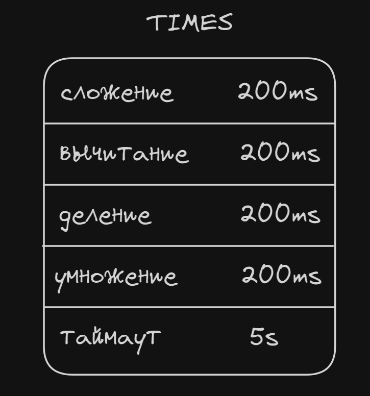

# "Распределенный вычислитель арифметических выражений"

## Оглавление readme
1. [Что реализовано + контакты](README.md#что-реализовано)
1. [Как пользоваться](README.md#как-пользоваться)
    * [Что установить](README.md#что-устанавливать)
    * [Как пользоваться](README.md#подготовка)
    * [Пользователи администраторы](README.md#пользователи-администраторы)
    * [Что и как можно ломать](README.md#что-и-как-можно-ломать)
1. [Примеры](README.md#примеры)
1. [Документация](README.md#документация)
    * [Как все работает](README.md#принцип-работы)
    * [Логгеры](README.md#логирование)
    * [Ошибки](README.md#ошибки)
---
### 
Калькулятор рабочий, все выражения считает и возвращает как надо. Ирина говорила, что старые критерии не учитываются, так что дополнительные страницы для удобства проверяющих.

Если есть какие-то вопросы, что-то не работает или у меня где-то ошибки — мой телеграмм @Tikhon1111 (я есть в чате курса)

---
### Что реализовано 
Поддержка пользователей, хранение в БД, общение через gRPC есть. Тестов нет.

#### Общий принцип работы
Калькулятор состоит из 4 частей - сервера http, оркестратора, агентов и вычислителей. Сервер принимает запросы от пользователя и либо сразу отвечает, либо направляет запрос оркестратору. Оркестратор управляет агентами, отправляя и получая от них выражения. Агенты представленны горутинами, однако, насколько возможно, имитируют что-то наподобии отдельных серверов, так как общаются с другими компонентами только по GRPC и запускаются отдельно. У агента есть горутины-вычислители, которые только умеют считать простейшие операции (a+b, a-b, a*b, a/b), "спать" и отправлять результат агенту. Агент, когда получает выражение, превращает его в набор таких простых операций и организовывает работу вычислителей, а потом возвращает результат оркестратору.   
  Подробнее об этом в пункте 4 (документация) - "как все работает".

#### Реализация
Программа должна переживать перезапуск, поэтому значения, связанные с выражениями хранятся в базе данных PostgreSQL.

   При первом запуске подготавливается БД — создаются необходимые хранилища (таблицы).  
   Потом запускаются http сервер, оркестратор с реализацией мониторинга агентов и агенты. Вычислители запускаются агентами по необходимости.  
   Когда пользователь отправляет запрос с выражением,  сервер проверяет его и возвращает код (200, 400, 500). Если все хорошо, присваивает ключ идемпотентности (UUID), кладет в базу и оповещает оркестратора. Оркестратор кладет выражение  в очередь и, когда агент запрашивает работу, отдает его агенту. Ошибку деления на ноль получает вычислитель и передает агенту, который сразу сообщает об этом оркестратору, не досчитывая выражение. Поддерживаются +, -, *, /, скобки не поддерживаются. Унарный минус нельзя ставить перед другим минусом, операция сложения с отрицательным числом считается за операцию вычитания.  

   Есть endpoint-ы внутренние и внешние. Внешние возвращают страницу html, на внутренние посылаются запросы от js клиента.

Внешних endpoint-ов всего 5: 
- Аутентификации
- Домашняя страница
- Выражения
- Настройки (время)
- Мониторинг компонентов + возможность убить оркестратор/сервер

Внутренние endpoint-ы возвращают различные данные по конкретному запросу от пользователя: авторизоваться, найти выражение, посчитать выражение и тд.

   Я у себя проверял, выражения вроде все считаются правильно, критичных ошибок возникать не должно.

   Для завершения работы можно убить сервер, перейдя на endpoint /calculator/internal/kill/server или просто отправить сигнал прерывания (^C на Windows) – программа его распознает, закроет все, что было открыто и завершит работу. Если по какой-то причине оба варианта не сработают, на Windows придется открывать диспетчер задач, искать процесс startup.go и завершать его, скриншот примера внизу. Про линукс не знаю. У меня такая проблема возникала только в начале разработки первой версии в феврале, ^C сработает в 99% случаев. Если все-таки у вас возникнет эта ошибка, пожалуйста, напишите мне, чтобы я поправил, а вы и другие проверяющие не страдали.

   

### Как пользоваться

#### Что устанавливать
Установить нужно только базу данных PostgreSQL. Я устанавливал здесь: https://www.enterprisedb.com/downloads/postgres-postgresql-downloads. Версия 16, для windows 64.

Для установки зависимостей отправьте команду "go mod tidy"

#### Подготовка
Для начала нужно установить несколько переменных в internal/config/config.go: главное задать константы для работы Postgres, в комментариях они подписаны. Порт по умолчанию '5432', имя пользователя задается при установке БД, по умолчанию "postgres". Пароль тоже задается при установке. DBName можно указать любое, главное чтобы базы с таким названием уже не было. DBNameDefault - база, к которой по умолчанию подключается пользователь, обычно "postgres".  
  В файле config.go можно изменять любые переменные, если вы понимаете, что изменится(например, изменив ip адрес, скорее всего подключения не получатся). Выводы логгеров не советую менять, потому что логгеры хартбитов и дебага выводят много информации, будут засорять консоль. В остальных файлах лучше ничего не менять)  

Перед первым запуском надо проверить, что в файле internal/config/db_existance.json все значения — false. Команда для запуска калькулятора: 'go run cmd/startup/startup.go'. После того, как запустится сервер, в консоле будет сообщение 'Калькулятор готов к работе!'. После этого можно будет перейти на 'http://127.0.0.1:8080/calculator/check', дальше все должно быть интуитивно понятно: войти в аккаунт(или выйти из него) - кнопка в правом верхнем углу. Тестовые сценарии пока отправляются curl-запросами на внутренние пути(будет ниже). Так как данные сохраняются в БД, при следующем запуске все выражения и переменные остануться такими же как в последний раз. Чтобы их сбросить — 'go run cmd/shutdown/shutdown.go' и выбрать вариант 2. Вариант 2 удаляет всю базу калькулятора из postgres, выбирайте его, когда закончили проверку. (вариант 1 устарел, постараюсь доработать сегодня вечером).

#### Пользователи-администраторы
Существуют пользователи с расширенными правами, их можно задать в файле internal/config/config.go, по умолчанию стоят "John Doe" с паролем "qwerty123" и "Aulus Agerius" с паролем "Lorem Ipsum". Вся их суть состоит в том, что они могут изменять время таймаута агентов и видеть выражения всех пользователей. На мой взгляд, это упрощает проверку, и вообще полезная механика для реального сервиса. Их аккаунты создаются автоматически при первом запуске калькулятора.

#### Что и как можно ломать
Оркестратор и агент поддерживают имитацию перезапуска. Для этого есть интерфейс на стрнице мониторинга.  
  При запуске оркестратора, он проверяет, есть ли в БД непосчитанные выражения — ничего потеряно не будет.  
Можно убить агента: при следующем хартбите, оркестратор вернет агенту ошибку о том, после чего горутина агента выйдет, а оркестратор узнает о смерти потому, что агент перестанет посылать хартбиты.
Перезапутить агента можно на той же странице мониторинга.
Отдельно вычислителей убивать не получится, да и смысла в этом нет.

### Примеры
1. - Заходите на сайт, переходите на вкладку "expressions"
   - Вас должно перенаправить на страницу входа в аккаунт
   - Вводите данные username: 'John Doe', password: 'qwerty123' и нажимаете "Log In"
   - Опять переходите на вкладку "expressions"
   - В первом поле для ввода вводите выражение '5+5' и нажимаете на кнопу "Посчитать"
   - Перезагружаете страницу и видите результат   
***
2. - Заходите на сайт, переходите на вкладку "expressions"
   - Вас должно перенаправить на страницу входа в аккаунт
   - Вводите данные username: 'Gordon', password: 'Freeman' и нажимаете "Посчитать"
   - Опять переходите на вкладку "expressions"
   - В первом поле для ввода вводите выражение 'bad request' и нажимаете на кнопу "Посчитать"
   - Высвечивается уведомление о том, что выражение невалидно

**Ключ идемпотентности** (ID выражения) — генерируется uuid на http сервере.

**Максимальная длина выражения** — 90 символов, если ее превысить, postgres не сможет положить выражение и выдаст ошибку.

**Максимальная длина имени и пароля** — 50 символов, если ее превысить, postgres не сможет положить выражение и выдаст ошибку. Пробелы из имени пользователя удаляются, так что "Линус Торвальдс" и "ЛинусТорвальдс" будут считаться за одно и то же.

**Парсинг времени** для запросов на изменение значений производится функцией time.ParseDuration() из стандартного пакета time. Подерживаемые величины: "ns", "us" (or "µs"), "ms", "s", "m", "h".

Если при запросе возвращается ошибка, возможно что-то не так с запросом, проверьте лог ошибок.

*Таблица с символами, которые нужно заменять в выражении, если делаете запросы на внутренние хендлеры*  
| символ | на что менять |
|:-------|:-------------:|
|+       |    %2B |
|-       |     -  |
|/       |    %2F |
|*       |    %2A |

---

### Документация  
  **Актуальна для первой версии проекта в феврале, доработаю позже**
  Возможные запросы:
   - Создать аккаунт  
   - Войти в аккаунт
   - Добавить выражение (посчитать)
   - Проверить статус выражения по ключу идемпотентности
   - Получить список всех выражений со статусами
   - Получить список всех агентов со статусами
   - Получить список доступных операций со временем их выполнения и таймаут для агентов с возможностью изменения
   - Убить/добавить агента
   - Убить оркестратор

#### Принцип работы
Эту часть можно не читать, но она существует)  
Про логгирование и ошибки лучше почитать, это может упростить вашу работу
***
##### База данных
База данных состоит из трех таблиц: таблица с выражениями, таблицы с процессами и таблицы со временем.  
      
      
      
      

##### Запуск
Функция main из файла startup.go обеспечивает, чтобы в БД были все необходимые элементы, запускает главную горутину оркестратора и ожидает сигнала из одного из двух каналов: канал, в который попадает пользовательская команда остановки и канал, в который оркестратр подает сигнал, когда отключается.

##### Оркестратор
Оркестратор — совокупность главной горутины, на которой поднимается http сервер и подгорутины, отслеживающей состояние агентов (менеджер агентов). У оркестратора есть структура с мапами и слайсами, с помощью которой он отслеживает состояние и общается с агентами. В ней есть слайс с состоянием агентов; мапы каналов для хартбитов, передачи задач, получения результатов; мапа с временем последнего хартбита и очередь с идентификаторами выражений, еще не принятых агентами.  
   **Главная горутина:**
1. подготавливает запросы в БД
2. запускает горутины агентов
3. запускает горутину менеджера
4. проверяет, нет ли непосчитаных выражений в таблице с запросами с прошлого раза и, если есть, отдает их агентам
5. Запускает http сервер   

**Менеджер агентов** проходится по каждому живому агенту и проверяет его каналы: хартбитов и результата. Если канал хартбитов открыт и агент отправил сигнал, менеджер обновляет время последнего хартбита агента. Если канал закрыт, менеджер записывает агента как мертвого, отменяет его контекст, чтобы тот точно отключился, проверяет, была ли у агента задача и, если была, отдает ее другому агенту/кладет в очередь. Даже если агента убил оркестратор, это единственный способ узнать о смерти. Убийство — своеобразная имитация непредвиденного выхода из строя. Затем менеджер проверяет канал результата. Полученное значение может быть либо true, либо false — выражения посчитано успешно или возникла ошибка (деление на ноль) соответственно. Оркестратор получает id выражения и результат из таблицы с процессами и записывает результат и наличие ошибок в таблицу с выражениями по полученному id. 

**HTTP сервер** слушает запросы пользователя. Некоторые запросы – например, получить статусы агентов – оркестратор выполняет сразу, только проверяя слайс с агентами. Для остальных запросов он получает (или изменяет) информацию из БД. При запросе на подсчет выражения, оркестратор еще и дает его агенту/кладет в очередь.

##### Агенты
Агенты общаются с оркестратором с помощью каналов, потенциально систему можно масштабировать с относительной легкостью, в отличии от системы, где агенты посылают http запросы — видео из ТЗ предполагает такую возможность. Агент запускает две горутины: хартбитов и решения. У горутины решения есть 2 состояния: "отдыха", когда она ожидает задачи от оркестратора и "работы" — цикл в котором агент ждет результатов от вычислителей. Когда в состоянии отдыха агент получает id выражения, он проверяет, нет ли уже такого выражения в таблице с процессами: если нет, агент производит парсинг выражения на слайс слайсов: слагаемые и множители, после чего начинает кладет обработанное выражение в таблицу с процессами и отсылает задания вычислителям, если есть — сразу получает распаршенное выражения и начинает отсылать задания вычислителям. Парсинг происходит простым делением по знакам: сначала на слагаемые, потом внутри каждого слагаемого на множители. Никакой польской нотации нет, поэтому и скобки не поддерживаются: в выражении может быть максимум 2 уровня приоритета. После парсинга(или получения из БД распершенного выражения) агент проходится по каждому уровню и отсылает вычислителю массив с координатами двух чисел, канал и время. Канал для всех вычислителей один на выражение. Его агент создает в фазе ожидания. Вычислитель выполняет операцию, останавливается на полученное время с time.sleep() и отправляет в канал массив с координатами и результатом. Если вычислителю попадается деление на ноль, он возвращает массив {-1, -1, -1, -1}. В "занятой" фазе агент получает значение от вычислителя. Если там ошибка деления на ноль, агент больше не отправляет ничего вычислителям и возвращает ошибку оркестратору. В противном случае агент заменяет первое число на пустую строку, а второе — на результат операции. Если была операция умножения(деления), агент проверяет, остались ли еще в слагаемом множители и, если не остались, добавляет число в слайс со слагаемыми. Если кол-во слагаемых нечетное и не равно единице, сначала добавляем ноль. Затем агент таким же алгоритмом проходится по слагаемым. Если в слайсе со слагаемыми осталось одно число и мы больше не ждем ни одного вычислителя — записываем результат в БД, отправляем оркестратору true (значит не было ошибок) и переходим в свободную фазу.

#### Логирование
***
В программе есть 3 логгера: ошибок, дебага и хартбитов. Их вывод можно указать в файле vars/variables.go

Файлы хартбитов и дебага автоматически очищаются каждый запуск калькулятора. Файл ошибок — нет.

С файлом дебага у меня были проблемы с кодировкой, их я поправил. В других файлах все было нормально, если у вас что-то не так открывается — напишите мне, пожалуйста. В принципе логи смотреть вам скорее всего нужно не будет, разве что логгер ошибок, но он по умолчанию дублируется в консоль.
В логах дебага могут встретиться ошибки с итерациями, числа, с которыми работает агент не отображаются вообще. Это объясняется логикой их обработки, добавлять поддержку логов времени уже не хватило. Еще там будут записи на английском, я их писал, чтобы в моменте исправлять ошибки, не обращайте на них внимания кроме случая, описанного в следующей главе.

#### Ошибки
***
На одном из этапов работы возникла такая ошибка, что запрос в postgres не отвечал и функция зависала. Если в логгере дебага последняя запись "Hello postgres" или "Сбросили подключения" и нет "Bye potgres" или "Отдаем выражение агенту %v.", скорее всего у вас такая же проблема. Это уже на стороне библиотеки для работы с БД, я ее вроде решил с db.reset(), но может быть у вас она опять возникнет. Напишите мне, пожалуйста, если заметите ее. Она может возникать при запуске, когда оркестратор проверят на наличие непосчитанных выражений, или когда отправляет запрос в БД на подсчет/получение выражения, но в теории может возникать при любом обращении в postgres.

Может еще возникнут ошибка о том, что .Scan() получил не такое кол-во аргументов, сколько ожидал, или не может записать ответ от базы в аргументы. Они тоже на стороне библиотеки pgx, попробуйте запустить калькулятор через какое-то время, мне это помогло.

Пока писал документацию, понял, что если возникает ошибка деления на ноль, агент не ждет оставшихся вычислителей и в следующем выражении это может привести к нарушению логики вычислений или даже к панике агента (если координаты старых чисел выходят за границы нового выражения). ~~Если заметите такое, попробуйте переместить декларацию канала на 157, 158 строках внутрь бесконечного цикла на строки 161, 162. Я бы сделал это сам, но пока все работало, а если начну изменять, боюсь, что все сломается, а времени тестить уже нет.~~ Должно быть исправленно, если заметите, напишите, пожалуйста, мне в телеграм об этом.

В некоторых браузерах не устанавливаются cookie-файлы или не посылаются fetch запросы. Я на это повлиять не могу, попробуйте использовать другой браузер. 
## КОНЕЦ
